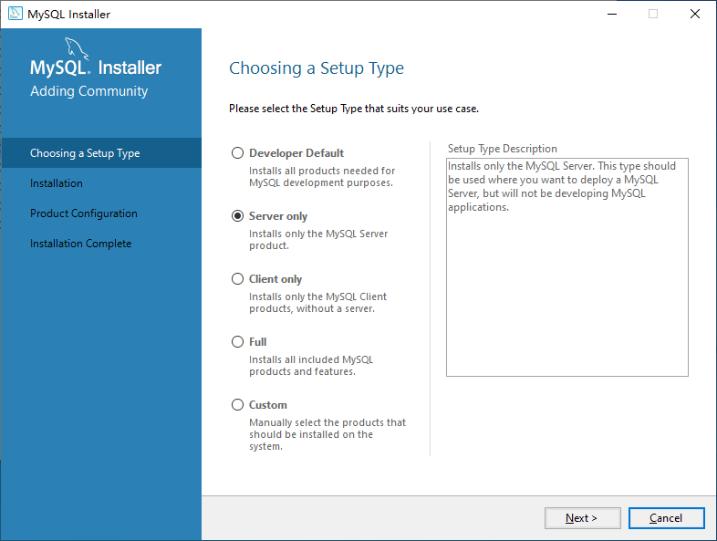
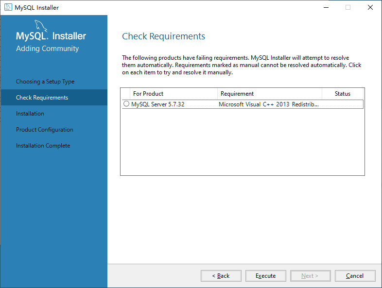
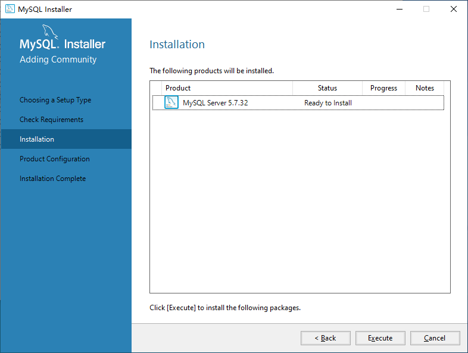
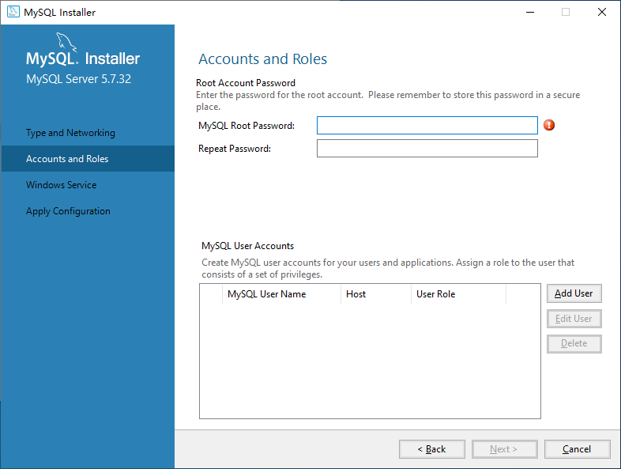
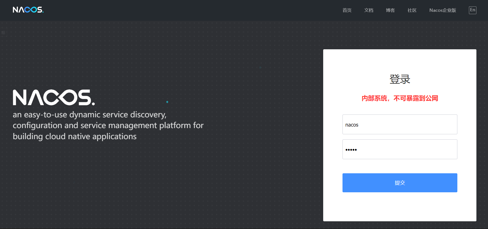
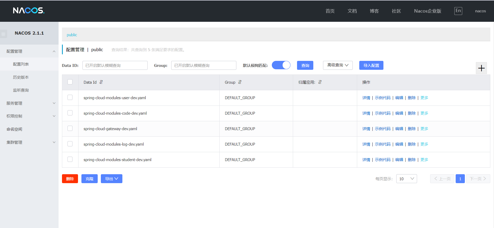
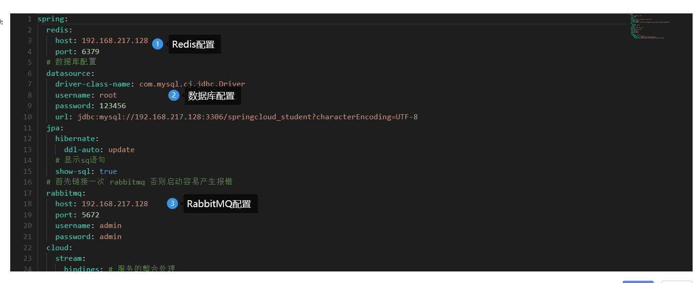
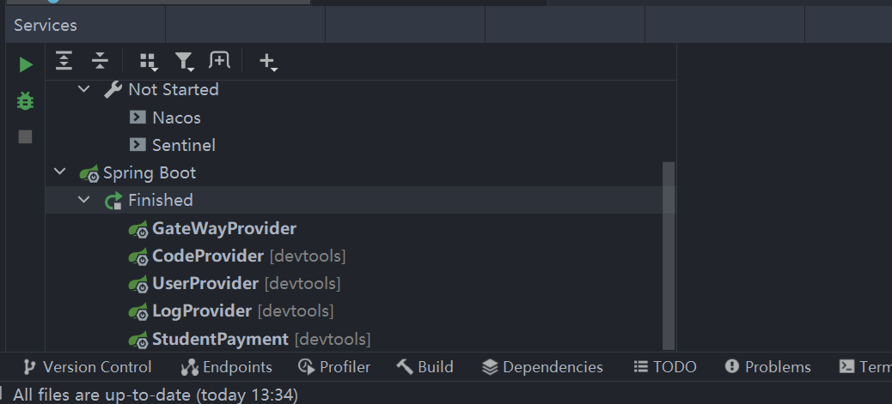

# 学生管理系统 - SpringCloudAlibaba

本项目使用 SpringCloudAlibaba 进行编写，前端使用了Vue，由于本人不擅长前端的编写，所以前端写的有些乱（我已经尽可能在写了）后端基于SpringCloudAlibaba进行编写，虽然但是并没有用到特别深入的东西，是目前个人所学知识的一些整合。

代码大部分写了注释，真的不容易，路过的小伙伴点个star吧

## 1、使用技术

```
spring cloud alibaba 2021.0.1.0
spring cloud 2021.0.1
spring boot 2.6.3

spring data JPA
spring cloud stram
spring cloud gateway
jjwt
sentinel
NacOS

MySQL 8.0.27
Redis latest
RabbitMQ latest
Maven >= 3.0

vue
element-ui
```

## 2、项目目录介绍

```
|-- StudentManager-SpringCloudAlibaba
    |-- common-api
    |-- gateway
    |-- modules
    |   |-- code-module
    |   |-- log-module
    |   |-- student-manager-module
    |   |-- user-module
    |-- nacos
    |-- student-vue
    |-- nacos_config_export_XXX.zip
```

### common-api

存放通用的一些类，包括实体类、异常类、Repository、返回状态码以及工具类

### gateway

路由网关，类似于传统SpringCloud中的Consumer，用来接收并转发处理前端发送的请求，默认端口号8080，可以前往**resource/bootstrap.yml**进行修改（注意sentinel也是8080端口，建议启动时修改sentinel端口，项目中配置的sentinel端口为8888）

### modules

主要存放后端的模块内容

#### code-module

验证码模块，主要进行验证码的发送，目前支持了邮箱验证码（因为不要钱啊），短信接口目前有但是不放出来了，阿里云的文档非常详细，想看的小伙伴可以去看看。

模块主要接受RabbitMQ传输的请求，接收到RabbitMQ的消息后，调用邮箱发送的工具类，同时将验证码存到Redis中，供其他模块进行调用。

需要注意的一点是，这里使用Stream的注解进行开发的，这个版本好像弃用了，但是俺还没有找到一些替换方案（百度找到了但是试了半天没啥用）

#### log-module

日志模块，这里主要是尝试一下openfeign（才不会说一开始是想要在前端也写一个页面展示日志内容的）实现方法主要是在user和student模块中使用aop对传入数据以及返回数据进行接受，（然后我就简单粗暴的直接把返回的数据塞进了数据库）随后使用openfeign记录日志。

// TODO: 这里有个bug就是双方有任意一方重启就会导致报错异常，需要双方同时重启

#### user-module

用户模块，核心模块之一，主要负责用户的登录注册操作，用户登录以后使用jwwt进行token加密，随后带着用户的username返回到前端。同时验证码也是在这里进行处理的。（要宕机一起宕机嘛）

#### student-manager-module

学生管理模块，经典增删改查四件套，主要负责学生以及班级的一系列操作。

### nacos_config_export_XXX.zip

每次项目导出的配置文件（一般我会直接提交nacos的直接启动即可，这个是防止nacos的数据消失）

## 3、项目启动

请先确保有以下环境：

```
RabbitMQ >= 3.5
Redis 任意版本即可
MySQL >=8
Sentinel 最新版本即可
```

### 1、启动RabbitMQ、Redis以及MySQL

#### 1）、MySQL的安装

https://dev.mysql.com/downloads/installer/

运行下载完毕的mysql安装包

读取完毕后进入到以下页面



选择ServerOnly进入到下一步中



点击Execute对缺少的环境进行安装，如果此按钮为灰色，直接进入到下一步即可

若果下载速度过慢，考虑进行科学上网



点击Execute进行安装

一直下一步进入到以下页面进行数据库密码的配置。



注：密码一旦忘记就较难找回，建议123456或1234

一直下一步到完成安装即可。

如果卡在最后一步，复制log内容到百度当中进行错误查找即可。

#### 2）、Redis的安装

https://github.com/ServiceStack/redis-windows

下载后解压，直接cmd运行redis.cmd即可

#### 3）、RabbieMQ的安装

看下这篇吧

https://blog.csdn.net/shuux666/article/details/124337419

#### Linux系统：

如果你是linux的话建议直接安装docker，同时使用这些命令一键部署

docker run -d -p 3306:3306 -v /home/mysql/conf:/etc/mysql/conf.d -v /home/mysql/data:/var/lib/mysql -e MYSQL_ROOT_PASSWORD=123456 --name mysql mysql:8.0

docker run -d --name rabbitmq -e RABBITMQ_DEFAULT_USER=admin -e RABBITMQ_DEFAULT_PASS=admin -p 15672:15672 -p 5672:5672 rabbitmq:management

docker run -itd --name redis -p 6379:6379 redis

### 2、运行nacos

打开项目录，运行以下命令

```bash
cd .\nacos\bin\
.\startup.cmd -m standalone
```

打开浏览器，输入以下网址，进入到如下页面

```
http://localhost:8848/nacos
```



账号密码都为nacos，进入后点击左侧配置管理进入到配置列表，查看是否有以下配置文件



### 3、修改配置文件

点击配置文件旁的编辑按钮，进入到配置页面



将对应的配置修改成本机内容即可。

主要修改内容为Redis的host、MySQL的username、password、url参数、RabbitMQ的host、username、password。如果有其他的自定义内容请自行修改。

### 4、*启动Sentinel

这个东西虽然没用上，但是项目中都配置了，即开即用，也可以不启动

下载地址：https://github.com/alibaba/Sentinel

运行：java -jar .\sentinel-dashboard-1.8.5.jar --server.port=8888

### 5、vue初始化

切换到vue目录，执行以下命令

```bash
npm install --registry=https://registry.npm.taobao.org
```

等待安装完成后执行

```bash
npm run serve
```

### 6、启动JAVA模块

（如果你刚刚直接用IDEA打开了的话应该maven安装好了吧）

如果maven正常配置且安装了的话，那么IDEA右下角会问你是不是需要启动service模式，一定要启动！这样你就可以在这个界面中一键启动项目



### 7、修改vue内容

在 **student-vue\vue.config.js** 中配置了后端地址，如果你修改了网关的配置文件，请更新

### 8、验证码发送邮箱配置

在code-module的util中有一个MailUtil，可以依据个人需要自行配置，如果懒就直接使用qq邮箱，修改邮箱以及密码，注意密码为qq邮箱中生成的授权码

### 9、数据库测试数据

在user-module的test文件夹下，提供了一个邮件发送以及注册方法的测试方法，先调用邮件发送再修改注册方法中的验证码进行注册。（当然你也可以自己在前端注册）

在student0module的test文件夹下可以批量生成学生信息

# TODO ：项目编写思路以及问题解决方案